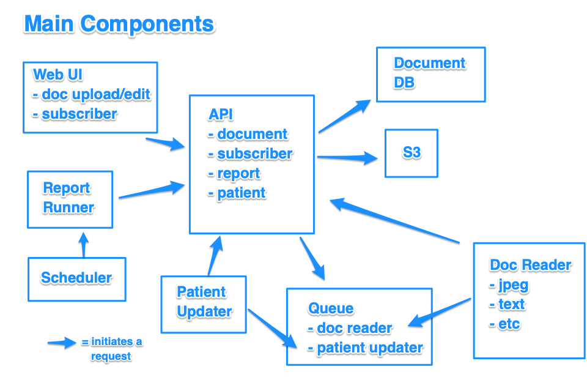
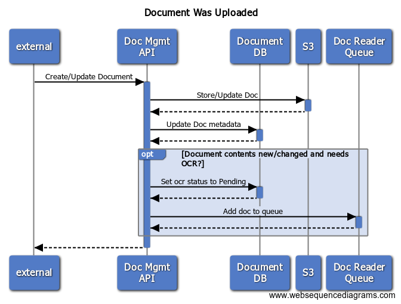
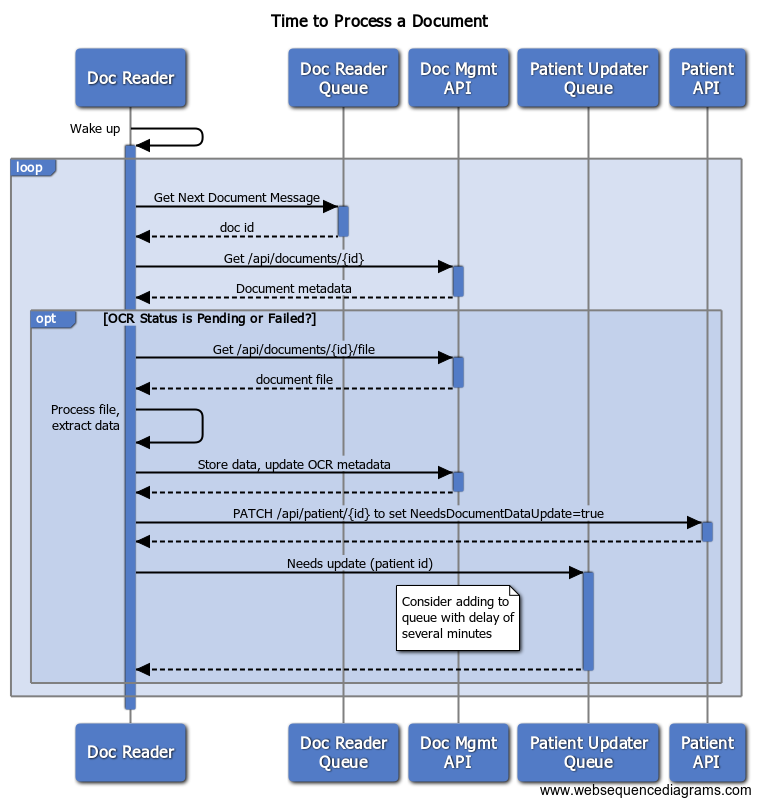
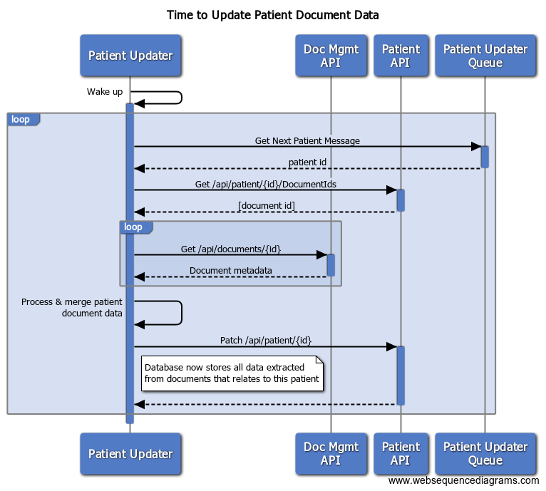
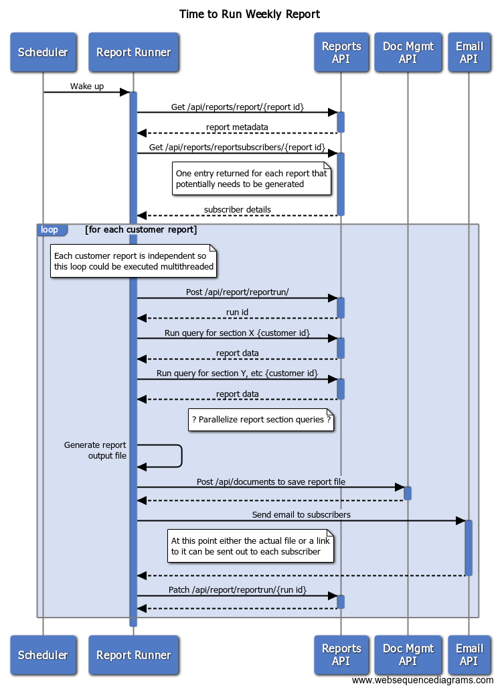

# Initial Assumptions

The following assumptions have been made to clarify the context of this design exercise and to help glue the design presentatation together.

* For the purpose of this exercise, "Patient" is used as the main subject of the data being agreggated in the report but it could be any other entity such as Site or other Organization or multiple entity types.
* "Complex image processing" means extraction of textual patient data from graphic files and structured text files.
* The relationship between Patient and document file is 1:m, so each document only has one subject to which it refers.
* There is no framework currently in use to provide reporting or scheduled job management services. An assessment of available frameworks will need to be done to potentially avoid reinventing the wheel in this work.
* As part of deployment of this new functionality, a process will be run that classifies all existing documents according to their type and updates the Document db records accordingly.
* A customer may have multiple audiences of reporting users within the organization. This would result in needing a report over its data with one set of parameters for audience A but a different set of parameters for audience B.
* A data model similar to the following already exists and this exercise builds on that model:
  * *Customer*
    * _id: string
    * Name: string
  * *User*
    * _id: String
    * CustomerId: String
    * Name: String
    * EmailAddress: String
  * *Patient*
    * _id: String
    * CustomerId: String
    * DocumentIdList: String[]
    * ..other patient data..

# Design Goals

* Process documents to extract their data as they come in [scalability, performance]
* Process extracted data from all documents for a given subject (Patient) to clean it up, resolve conflicts and store in the database [reliability]
* Parallelize where feasible [performance]
* Run reports, per customer, based on well-structured db data [performance]

# Design Overview

The following represents the major components involved in implementing the report processing.

## New Components

### Scheduler

Responsible for running tasks according to a preconfigured schedule and logging the result status of each invocation.

### Report Runner

During each execution run, this component is responsible for creating and emailing the specific report for each customer. Each run is for only one type of report. The report runner controls the execution of report queries, the generation of the pdf to present the data, storage of the resulting pdf and email notification to the users.

The Report Runner is restartable for a given customer, should any specific report need to be regenerated. It can furthermore just resend the last-generated report for a given customer.

Tracking data, to clarify any customer reports that did not correctly get generated and sent, is held in *ReportSubscribers* collection.

### Queues

Two new queues are introduced in order to allow background processing of data.  One drives the Doc Reader and the other drives the Patient Updater.  In the case of the Patient Updater, messages are placed here with a delay such that a message is not visible by any consumer until a certain amount of time has passed since the message was published.

### Doc Reader

This component is executed for a given record in the Documents collection and is responsible for performing OCR (in the case of an image) or parsing and extraction of data (in the case of a text document).

It reads the IDs of documents that need to be processed from the *Doc Reader Queue* and stores the output of processing back into the *Document* record.  The output includes both processing metadata (see *Document.ProcessingXyz fields) and the extracted business data itself.

In order to increase processing throughput, multiple Doc Reader instances can be running against the queue.

### Patient Updater

This is an intermediate data-cleansing component in the processing who's purpose is to run any simple aggregation, disambiguation or conflict resolution between all of the documents that have been processed for a given patient.  It should resolve questions such as:
* How to resolve a Date of Birth for the same patient that differs between documents.  What if the address or telephone number differs?
* Should medicines listed and possibly duplicated across multiple documents, be consolidated into a clear set of medication.

Any data-based business rules regarding how information is to be imported from raw documents into the official business data system of record live here.

## Events

The following are the main events considered in the design:

### Document Upload/Edit

This occurs whenever a user or other process initially uploads a document or causes the contents of an already uploaded document file to change.

### Time to Process a Document

This occurs when the system notices that a document requires processing in order to extract the data. Typically, happens shortly after "Document Upload/Edit".

### Time to Update Document Data

This occurs whenever the system notices that the data extracted from uploaded documents needs to be promoted/consolidated onto the Patient record itself. Typically happens whenever documents uploaded for a Patient have been changed.

### Time to Run Weekly Report

This represents the need to generate and send the report each week.

# Schema Changes

* *Document*
    * PatientId: String
        * identifies the subject to which this document belongs
    * ProcessingStatus: String
        * enum of Pending, InProgress, Complete, Failed
        * to allow control of processing job, avoiding race conditions and duplicate processing, as well as ops reporting on failures
    * ProcessingFailureCount: Number
        * ops reporting on failures, whether they are transient or persistent issues with this document
    * ProcessingStatusLastUpdated: Date
        * ops reporting on when this document was last processed
    * ProcessingDurationMillis: Number
        * milliseconds spent on the last processing attempt of this document
        * for performance analysis and tuning
    * ProcessingExtractedFeatures: {}
        * embedded document representing the raw data extracted from the last successful processing run
    * ContentsLastUpdated: Date
        * records when the content of this document (e.g. excluding metadata changes) was created or last updated
        * ops reporting on latency issues for this document or in aggregate for performance tuning
    * ContentType: String
        * records the data type of this file: jpeg image, xml text, json text
        * suggest using known mime types
* *Report* // represents a type of report in the system. Currently there is just one record here.
    * _id: String
    * e.g. Name: String
    * ..any other data or static content required to build this type of report..
* *ReportSubscribers* // represents the set of recipients and any other parameters for a given report run
    * _id: String
    * CustomerId: String
      * used to ensure only users and patients belonging to this Customer are included
    * ReportId: String
      * id of the report type
    * SubscribedUserIds: String[] 
      * list of user ids subscribed to this report
    * LastSuccessfulRunId: String
      * id of the last report run job for this
    * LastSuccessfulReportData: ??
      * we should store the last-generated output. Could reuse the Document API.
* *ReportRun*
    * _id: String
    * e.g. StartTime: Date
    * ..various job control data..
* *Patient*
    * NeedsDocumentDataUpdate: bool
      * set true whenever a relevant document has been changed
      * ensures that duplicate queue messages do not cause duplicated processing

# API

## Document

Note that there are schema changes affecting existing code, otherwise the API is unchanged.

## Subscriber

### POST /api/reportsubscriber
* Creates a reportsubscriber record
### GET /api/reportsubscriber/{id}
* Returns a specific reportsubscriber by id
### GET /api/reportsubscribers/{CustomerId}/{SubscriberId}
* Returns all sets of subscribers for a given customer and (optionally) an invididual user.
* Supports the assumption that a given customer having multiple audiences for its report.
### PATCH /api/reportsubscriber/{id}
- Updates the reportsubscriber record (any property except _id)
### DELETE /api/reportsubscriber/{id}
- Deletes the reportsubscriber record 

## Report Execution

### POST /api/reportrun
* Creates a record representing a new execution of the report generation process
### PATCH /api/reportrun/{id}
* Updates the reportrun record regarding the progress of this execution.
### GET /api/reportrun/{id}
* Returns the record of this reportrun

### GET /api/reportquery/{id}/{params}
* Executes a reporting query for a section of report, given the id of the query to run (as defined in server code or config) and the necessary parameters for this query.  Returns the resulting dataset for this query.

## Patient

Note that depending on the size and complexity of data stored for a Patient, these calls may need to be further broken down to allow more selective CRUD operations.

### POST /api/patient
- Creates a patient and associated data.
### GET /api/patient/{id}
- Returns patient and associated data.
### PATCH /api/patient/{id}
- Updates patient and associated data.
### DELETE /api/patient/{id}
- Deletes patient and associated data.

## Queue

### POST /api/queueing/docreader
- Adds a message to the docreader queue, containing "_id" of the Document to be processed.
### POST /api/queueing/patientupdater
- Adds a message to the patient updater queue, containing the "_id" of the Patient to be updated, along with an optional delay.  The delay default is configurable (and should be non-zero by design).

# Further Work

Significant further design work is required on the following ares not in scope for the design exercise:

* UI for
  * Subscribe/Unsubscribe to a report
  * View & download my reports
  * Reporting framework and better data model to support additional future report types.
* Internal ops reporting to keep track of:
  * any errors in document processing or report generation
  * statistics on report generation times both for all customers in the weekly run as well as per customer to identify hotspots
  * statistics on document/image processing times
* After performance testing of the report performance on various datasets, if the data is large enough, it may become necessary to pre-aggregate the data or use specialized ETL tooling. Additionally if the query logic is complex it may similarly need to be pushed down into a database with a strong query optimizer.
* Security needs to be considered with specific regards to the proposed API design.  As it stands, the API is designed assuming that the caller is trusted.  However, if the trust boundary lies between the caller and the API then the API design needs hardening so that untrusted client code does not have privileged access to modify the data.
